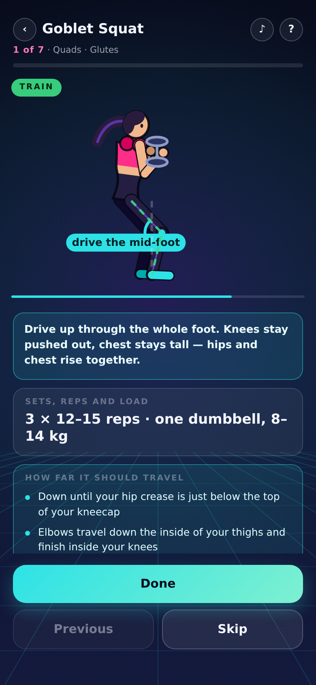

# Gym Trainer — a Plethora Bit

A training week with an animated coach who shows you how to do it *right*.

Every exercise plays as **one continuous demonstration in two parts**:

- **Setup** — how you stand, and how you pick the weight up off the floor.
- **Train** — the working posture, looped three times, then back to setup.

There are no rep counters and no countdowns. Your sets, reps and suggested load
are written under the video, along with **how far each rep should travel** —
the exact landmark it starts and stops at. You tap **Done** when you have
finished, and it moves you to the next exercise. Finish every exercise in a day
and that date is ticked on your calendar.

There is deliberately **no wrong-form variant**. The Bit only ever shows the
correct movement; the teaching is in the setup reel, the travel endpoints and
the alignment guides.

## The week

33 exercises, each with its own setup reel, range-of-motion endpoints, coaching
cues and joint callouts.

| day | focus | exercises |
| --- | --- | --- |
| Monday | Legs · Shoulders · Biceps | 7 |
| Tuesday | Back · Triceps | 7 |
| Wednesday | Chest · Forearms · Cardio | 6 |
| Thursday | Hamstrings · Glutes · HIIT | 7 |
| Friday | Back · Chest · Shoulders · Arms | 6 |

Saturday and Sunday are rest days; the streak counter skips them rather than
breaking on them.

## Layout

    main.js         the Bit - single source of truth
    plethora.json   manifest
    build/main.js   upload artifact, generated
    dev/            local harness and QA tooling, never uploaded

## Building and uploading

    python3 dev/build.py     # main.js -> build/main.js, strip + node --check

`dev/build.py` strips comments and indentation and squeezes whitespace outside
string literals. It **never minifies** — mangled source is rejected by the
draft validator — and it fails the build if it finds a URL anywhere in the
artifact, including in a comment.

The pairing and upload flow, and what the validator's error messages actually
mean, are in the **`plethora-bit`** skill at the repo root rather than here,
because none of it is specific to this Bit.

## The rig

The trainer is a keyframed 2D figure drawn procedurally — packaged assets are
disabled (`maxAssets` is 0) and remote images are blocked, so there is nothing
to load. Angles are absolute and in degrees: **0 points straight down, +90
points right, -90 points left**, and the torso runs the other way from the
pelvis so 0 is upright.

A pose is a string, not an object literal:

    tr('0|to4 na72 nb-58 nt2 ns1', '0.5|y0.20 to16 nt44 ns-52 no86')

Codes are listed in `CODES` near the top of `main.js`. Train reels are nearly
all A-B-A, so `'1|=0'` reuses keyframe 0's pose instead of repeating it.

**Setup reels are shared.** Picking two dumbbells up off the floor is the same
movement whatever you are about to do with them, so `RIG` holds each pickup
once and an exercise contributes only its closing "set position" step via `sxs`
(caption) and `sxt` (keyframe). A shared rig is only ever shared with kit it
actually describes: the sumo squat, the suitcase hold and the calf raise each
have their own, because a rig that narrates two dumbbells while one hand is
loaded teaches the wrong thing.

The general lessons about authoring and QAing this kind of rig — the ones that
cost a render to discover — are in the **`procedural-figure-animation`** skill
at the repo root.

## QA

    node dev/lint.mjs               # exercise contract checks, no browser
    node dev/shots.mjs              # walk the whole UI, screenshot each screen
    BUILT=1 node dev/shots.mjs      # same, against build/main.js
    node dev/posegrid.mjs out.png 0,0.34,0.66,1          # every exercise
    node dev/posegrid.mjs out.png 0,0.5,1 goblet         # just one

`dev/lint.mjs` enforces the invariants that have actually broken here: every
caption and marker list ends at `t = 1` and ascends, every train loop returns
to its start pose, every setup reel moves and hands over in the pose its train
reel begins in, and nothing is defined but unused. Run it before rendering —
it is instant and catches most of it.

`dev/shots.mjs` fails loudly on a page error and prints the platform lifecycle
events, so a broken `ready()` shows up without reading the screenshots. Current
screens are in `docs/screens`: `home`, `day-menu`, `setup-reel`, `train-reel`,
`progress`, plus `monday-qa` and `week-qa` — the pose contact sheets.

**Numbers cannot tell you a pose is wrong.** Author a day, then shoot a contact
sheet before trusting it.

## Notes

Not medical advice. Weight suggestions are a starting point only.
