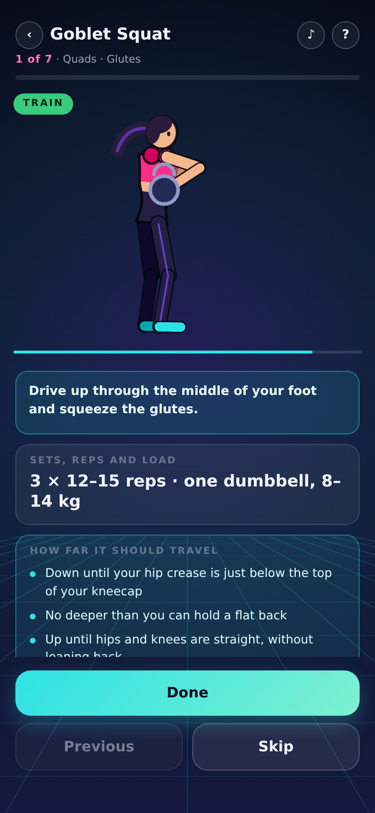

# Gym Trainer — a Plethora Bit

A training week with an animated coach who shows you how to do it *right*.

Every exercise plays as **one continuous demonstration in two parts**:

- **Setup** — how you stand, and how you pick the weight up off the floor.
- **Train** — the working posture, looped three times, then back to setup.

There are no rep counters and no countdowns. Your sets, reps and suggested load
are written under the video, along with **how far each rep should travel** —
the exact landmark it starts and stops at. You tap **Done** when you have
finished, and it moves you to the next exercise. Finish every exercise in a day
and that date is ticked on your calendar.

There is deliberately **no wrong-form variant**. The Bit only ever shows the
correct movement; the teaching is in the setup reel, the travel endpoints and
the alignment guides.

## Status

All five training days are built — 33 exercises, each with its own setup reel,
range-of-motion endpoints, coaching cues and joint callouts.

| day | focus | exercises |
| --- | --- | --- |
| Monday | Legs · Shoulders · Biceps | 7 |
| Tuesday | Back · Triceps | 7 |
| Wednesday | Chest · Forearms · Cardio | 6 |
| Thursday | Hamstrings · Glutes · HIIT | 7 |
| Friday | Back · Chest · Shoulders · Arms | 6 |

Saturday and Sunday are rest days; the streak counter skips them rather than
breaking on them.

## Layout

    main.js         the Bit - single source of truth
    plethora.json   manifest
    build/main.js   upload artifact, generated
    dev/            local harness and QA tooling, never uploaded

## Uploading, and what the validator actually enforces

    python3 dev/build.py     # main.js -> build/main.js, strip + node --check

Four things were measured against the live draft endpoint, because every one
of them had first been guessed wrong:

1. **Never minify.** terser output is rejected at any size with the generic
   error *"This bit uses unsupported remote resources"*. The identical code
   unminified is accepted. The validator statically analyses the source and
   mangling defeats it. `dev/build.py` therefore only strips comments and
   indentation and squeezes whitespace outside string literals — every
   identifier and every literal survives byte-for-byte.
2. **No URLs anywhere in the source**, not even inside a comment. A GitHub
   link in a build banner was enough to trip the same error. `dev/build.py`
   fails the build if it finds one.
3. **The size ceiling is about 92 KB for this code, not the 80 KB once
   assumed, and not the 100 KB a padded probe suggested.** Measured:
   92.6 KB uploads first try, 93.5 KB needs retries, 95.9 KB and above always
   times out with *"Request deadline exceeded"*. A padded 100 KB probe of
   trivial statements passed, so the budget is not purely bytes — real code
   with many string literals costs the validator more.
4. **Uploads are flaky near the ceiling.** Even a passing size often fails
   once or twice before succeeding, so always retry before concluding
   anything about size.

That generic remote-resources message says nothing about size. An earlier note
in this repo blamed it on an ~80 KB budget and sent a redesign down the wrong
path. Trust the message and bisect against the endpoint.

### Keeping it small anyway

### Keeping it small anyway

- **A compact pose DSL.** A pose is a string, not an object literal:

      tr('0|to4 na72 nb-58 nt2 ns1', '0.5|y0.20 to16 nt44 ns-52 no86')

  Codes are listed in `CODES` near the top of `main.js`.
- **Shared setup reels.** Picking two dumbbells up off the floor is the same
  movement whatever you are about to do with them, so `RIG` holds each pickup
  once and an exercise contributes only its closing "set position" step via
  `sxs` (caption) and `sxt` (keyframe). Kit that needs its own approach —
  the deadlift bar, a lat pulldown, the Bulgarian split squat's sit-and-measure
  — gets its own rig rather than being forced into a generic one.
- **Back-referenced keyframes.** Train reels are nearly all A-B-A, so `'1|=0'`
  reuses keyframe 0's pose instead of repeating the string.

## The rig

The trainer is a keyframed 2D figure drawn procedurally — packaged assets are
disabled (`maxAssets` is 0) and remote images are blocked, so there is nothing
to load. Angles are absolute and in degrees: **0 points straight down, +90
points right, -90 points left**, and the torso runs the other way from the
pelvis so 0 is upright.

### Authoring rules, learned by getting them wrong

1. **She faces +x.** Anything travelling forward is a *positive* angle. A
   negative forearm angle curls the bar up behind her head.
2. **A foot's toe must end below the ankle.** Invert it and she is standing on
   her heels instead of up on her toes.
3. **Seated only reads in side view.** The rig has no depth, so a seated front
   view has nowhere to put the thighs and renders as a splayed float.
4. **Every setup reel must move**: squat to the floor, grip, stand, set
   position. Three standing frames teach nothing, and the setup reel is the
   whole point of the Bit.
5. **Exaggerate small movements.** A true-scale calf raise is invisible at
   phone size, and it needs a step prop so the heel has something to drop
   below.
6. **Weights live on the floor until they are picked up.** `RIG.gr` is the
   phase at which the hands take the load. Drawing a barbell in her fists the
   whole way through made the curl setup nonsense: she stood holding the bar,
   then squatted to pick up the bar she was holding.
7. **Markers are keyed to a round trip.** A train reel runs 0 = start,
   0.5 = the top, 1 = back to the start. Reading it as a one-way sweep labelled
   the bottom of the shoulder press "locked out".
8. **Two views when one cannot tell the truth.** A hinge only reads from the
   side; the arc of a fly only reads from the front. `vwT` gives the train reel
   its own camera, and the phase pill already tells the viewer the reel changed.
9. **Seated and lying poses need the pelvis placed by hand.** There is no IK:
   `y` is what puts the ankles on the floor, and arm reach limits how deep a
   hinge can go before the hands stop reaching the bar.

None of these are detectable by reading the numbers — every one was found by
rendering. Author a day, then shoot a contact sheet before trusting it.

## QA

    node dev/shots.mjs              # walk the whole UI, screenshot each screen
    BUILT=1 node dev/shots.mjs      # same, against build/main.js
    node dev/posegrid.mjs out.png 0,0.34,0.66,1          # every exercise
    node dev/posegrid.mjs out.png 0,0.5,1 goblet         # just one

`dev/shots.mjs` fails loudly on a page error and prints the platform lifecycle
events, so a broken `ready()` shows up without reading the screenshots. Current
screens are in `docs/screens`: `home`, `day-menu`, `setup-reel`, `train-reel`,
`progress`, plus `monday-qa` — the pose contact sheet for all seven exercises.

## Notes

Not medical advice. Weight suggestions are a starting point only.
